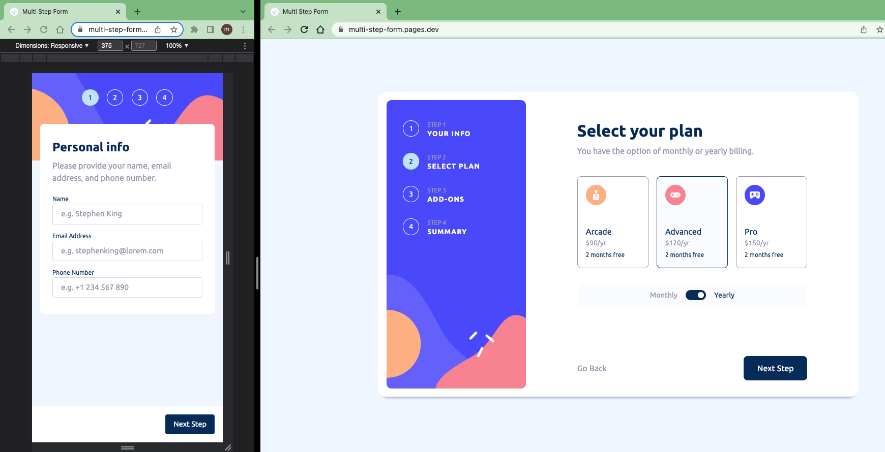

# Frontend Mentor - Multi-step form solution

This is a solution to the [Multi-step form challenge on Frontend Mentor](https://www.frontendmentor.io/challenges/multistep-form-YVAnSdqQBJ).

## Table of contents

- [Overview](#overview)
  - [The challenge](#the-challenge)
  - [Screenshot](#screenshot)
  - [Links](#links)
- [My process](#my-process)
  - [Built with](#built-with)
  - [What I learned](#what-i-learned)
  - [Continued development](#continued-development)
  - [Useful resources](#useful-resources)
- [Author](#author)
- [Acknowledgments](#acknowledgments)

## Overview

### The challenge

Users should be able to:

- Complete each step of the sequence
- Go back to a previous step to update their selections
- See a summary of their selections on the final step and confirm their order
- View the optimal layout for the interface depending on their device's screen size
- See hover and focus states for all interactive elements on the page
- Receive form validation messages if:
  - A field has been missed
  - The email address is not formatted correctly
  - A step is submitted, but no selection has been made

### Screenshot

### Links

- Solution: [frontendmentor.io](https://www.frontendmentor.io/solutions/multi-step-form-5MLk0OYh4I)

- Live Site: [netlify.app](https://multi-step-form.pages.dev/)

## My process

- Create All Components blueprint
- Work on Mobile Design based on `design` folder
- Work on multi-step form functionality
- Work on Desktop Design based on `design` folder

### Built with

- React
- Framer Motion
- Css Module
- Grid, Flex, Custom variable
- Semantic HTML5 markup
- Mobile first workflow

### What I learned

Creating slider, and pagination with a central button was the tricky part that I learned a lot from them.

### Continued development

More practice on framer motion and as always React

### Useful resources

[Framer Motion](https://framer.com/motion)

## Author

- Frontend Mentor - [@siavhnz](https://www.frontendmentor.io/profile/siavhnz)

- github - [@siavhnz](https://www.github.com/siavhnz)

## Acknowledgments

Thanks To

[Frontendmentor.io](https://www.frontendmentor.io/challenges) - for their Excitement challenges  

[Perfect Pixel](https://chrome.google.com/webstore/detail/perfectpixel-by-welldonec/dkaagdgjmgdmbnecmcefdhjekcoceebi?hl=en) - for such a great extension
